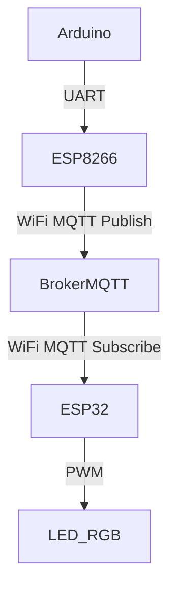

# 📌 Documentation du Projet IoT - Surveillance d’Humidité avec MQTT

> **Équipe Hanse Mance Mans**  
> Nicolas DELAHAIE  
> Émile RICORDEL  
> Anas DAOUI  
> Clément ANDRIEU


## **1️⃣ Présentation du Projet**
Ce projet IoT utilise **un capteur DHT11** pour mesurer l’humidité et la transmet via **un ESP8266** à un **broker MQTT**. Un **ESP32** reçoit ensuite ces données et ajuste une **LED RGB** en fonction du niveau d’humidité.

### **🛠️ Composants utilisés :**
- **1 Arduino** : Lit l’humidité avec le capteur DHT11 et l’envoie à l’ESP8266 via UART.
- **1 ESP8266** : Reçoit les données de l’Arduino et les transmet au **broker MQTT** via WiFi.
- **1 Ordinateur avec un broker MQTT local** : Réception des messages et diffusion aux abonnés.
- **1 ESP32** : Reçoit les données MQTT et contrôle une **LED RGB** en fonction du niveau d’humidité.
- **1 Capteur DHT11** : Mesure l’humidité.
- **1 LED RGB** : Indique visuellement l’état d’humidité.
- **Alimentation (USB)** : Fournit l’énergie aux composants.

---

## **2️⃣ Schéma de l’Architecture IoT**

### **📡 Communication entre les composants :**
1. L’Arduino mesure **l’humidité** via le capteur **DHT11**.
2. Il envoie les valeurs **par communication série** à l’ESP8266.
3. L’ESP8266 **publie** ces valeurs sur **le broker MQTT local (ordinateur)**.
4. L’ESP32 **s’abonne** aux données et ajuste la **LED RGB** selon l’humidité.



---

## **3️⃣ Configuration des Circuits**
### **📌 Circuit Arduino (Capteur DHT11)**
- **DHT11 (Humidité) → Arduino**
  - VCC → **5V**
  - GND → **GND**
  - Data → **D3**
- **Communication avec l’ESP8266** :
  - TX Arduino → RX ESP8266
  - RX Arduino → TX ESP8266
  - GND commun entre les deux

### **📌 Circuit ESP8266 (WiFi + MQTT)**
- **Connexion WiFi**
  - Se connecte au réseau WiFi
  - Envoie les données MQTT au broker local sur l’ordinateur
- **Broches utilisées :**
  - RX/TX pour communiquer avec l’Arduino
  - WiFi activé pour MQTT

### **📌 Circuit ESP32 (Actionneur LED RGB)**
- **Abonnement au topic MQTT**
  - ESP32 récupère les données de l’humidité
  - Contrôle une LED RGB selon les seuils :
    - Rouge (humidité faible < 30%)
    - Vert (humidité normale 30-60%)
    - Bleu (humidité élevée > 60%)
- **Broches de la LED RGB :**
  - Rouge → **GPIO16**
  - Vert → **GPIO17**
  - Bleu → **GPIO18**

---

## **4️⃣ Configuration et Démarrage du Projet**
### **📌 Étape 1 : Démarrer le Broker MQTT sur l’ordinateur**
1. Ouvrir un terminal et lancer Mosquitto (si installé) :
   ```sh
   mosquitto -v
   ```
2. Vérifier qu’il écoute bien sur le port `1883`.

### **📌 Étape 2 : Vérifier la réception des messages**
Dans un terminal, abonne-toi aux topics MQTT pour voir les messages :
```sh
mosquitto_sub -h localhost -t "capteur/humidity" -v
```

### **📌 Étape 3 : Démarrer les Microcontrôleurs**
1. **Téléverser le code dans l’Arduino** (Capteur DHT11).  
2. **Téléverser le code dans l’ESP8266** (Transmetteur WiFi MQTT).  
3. **Téléverser le code dans l’ESP32** (Récepteur + LED RGB).  

### **📌 Étape 4 : Vérifier le bon fonctionnement**
1. Observer les messages dans le terminal (`mosquitto_sub`).
2. Observer la LED RGB sur l’ESP32.
3. Ajuster l’humidité (ex: souffler sur le capteur) et vérifier la couleur de la LED.

---

## **5️⃣ Déplacement du Broker MQTT sur le Raspberry Pi**
Lorsque le Raspberry Pi est prêt, il peut remplacer le broker MQTT de l’ordinateur.
1. **Installer Mosquitto sur le Raspberry Pi :**
   ```sh
   sudo apt update
   sudo apt install mosquitto mosquitto-clients
   ```
2. **Modifier l’adresse MQTT dans les codes des ESP** (`mqtt_server = "192.168.X.X"` avec l’IP du Raspberry).
3. **Redémarrer tout et tester la communication.**

---

## **📌 Conclusion**
Ce projet met en place **une architecture IoT basée sur MQTT** avec **capteurs**, **WiFi**, et **actionneurs**. Il peut être facilement amélioré en ajoutant une interface web ou un stockage de données.

📌 **Si un problème survient, vérifier en premier :**
✅ **Le WiFi fonctionne ?**  
✅ **Le Broker MQTT reçoit bien les messages ?**  
✅ **Les ESP sont bien abonnés et publient les bonnes valeurs ?**  

---

🚀 **Projet terminé ! Tu peux maintenant tout mettre sur GitHub !** 🎉
