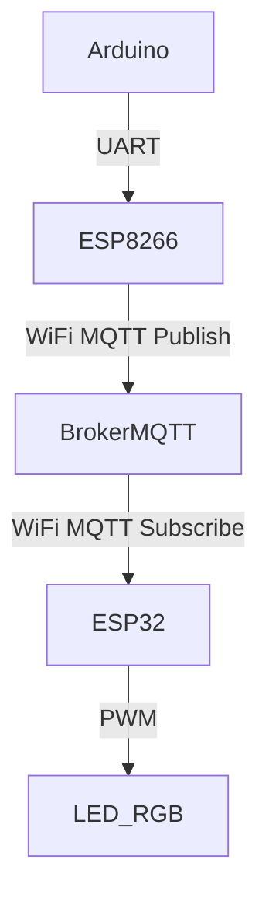

# Projet IoT - Surveillance d’Humidité avec MQTT

> **Équipe Hanse Mance Mans**  
> Nicolas DELAHAIE  
> Émile RICORDEL  
> Anas DAOUI  
> Clément ANDRIEU

## Présentation du projet

[Document de présentation du projet (Word)](https://auvencecom-my.sharepoint.com/:w:/g/personal/nicolas_delahaie_ynov_com/EWxNXPk6Hf5GhAFUDsCuzskBGGFIuqWOAZh5HHxPKcpJHA?e=mTtp2u)

Ce projet IoT utilise **un capteur DHT11** pour mesurer l’humidité et la transmet via **un ESP8266** à un **broker MQTT**. Un **ESP32** reçoit ensuite ces données et ajuste une **LED RGB** en fonction du niveau d’humidité :

- 🔴 **Rouge** : Air sec (< 30%)
- 🟢 **Vert** : Humidité normale (30% - 60%)
- 🔵 **Bleu** : Air humide (> 60%)

Les LEDs peuvent être allumées ou éteintes manuellement via les boutons correspondants sur la télécommande, comme on peut le voir sur cette [vidéo de démonstration](demonstration.mp4).

### Documentation

Les diagrammes sont trouvables dans le dossier `docs/`. Les fichiers avec l'extension `.drawio` peuvent être ouverts via l'extension `hediet.vscode-drawio` sur VSCode.

## Matériel utilisé

[Schema de l'installation](schema_arduino.png)

- **Câbles et breadboard**
- **Arduino Uno** avec ses équipements :
  - Capteurs :
    - DHT11 (humidité et température)
  - Pilotage :
    - Recepteur infrarouge (IRReceiver)
    - Télécommande
  - Affichage :
    - Écran LCD 16x2 (mode parallèle)
    - Potentiomètre 10kΩ (pour le contraste du LCD)
  - Éclairage :
    - 1 LED RGB (anode ou cathode commune)
    - 1 LED rouge
    - 1 LED bleue
    - 2 résistances 220Ω
- **Raspberry** avec ses équipements :
  - Écran HDMI
  - Souris
  - Clavier
  - Antenne LoRa
- **ESP32**
- **ESP8266**

## Fonctionnement

### Communication entre les composants

1. L’Arduino mesure **l’humidité** via le capteur **DHT11**.
2. Il envoie les valeurs **par communication série** à l’ESP8266.
3. L’ESP8266 **publie** ces valeurs sur **le broker MQTT local (ordinateur)**.
4. L’ESP32 **s’abonne** aux données et ajuste la **LED RGB** selon l’humidité.

## Branchements

### Circuit Arduino

- DHT11 (Humidité)
  - VCC → 5V
  - GND → GND
  - Data → D3
- TX Arduino → RX ESP8266
- RX Arduino → TX ESP8266
- GND commun entre les deux

### Circuit ESP8266 (WiFi + MQTT)

- Connexion au WiFi
- RX/TX pour communiquer avec l’Arduino
- WiFi activé pour MQTT

### Circuit ESP32 (Actionneur LED RGB)

- Abonnement au topic MQTT (pour récupèrer les données de l’humidité)
- LED Rouge → GPIO16
- LED Vert → GPIO17
- LED Bleu → GPIO18

## Installation logicielle

### Arduino (capteurs)

Le code source est présent sur la plateforme en ligne Wokwi, qui permet de simuler le circuit electronique et de coder directement dedans. [Projet Wokwi](https://wokwi.com/projects/422783187973623809)

Lorsque le code est fonctionnel, il faut ensuite le copier sur la carte physique.

### Raspberry (serveur publique)

Pour lancer le serveur publique sur la Raspberry, il suffit de créer un container Docker via `docker compose up -d` à la racine du projet.

## Problèmes rencontrés

**Si un problème survient, vérifier en premier :**

- Le WiFi fonctionne ?
- Le Broker MQTT reçoit bien les messages ?
- Les ESP sont bien abonnés et publient les bonnes valeurs ?
